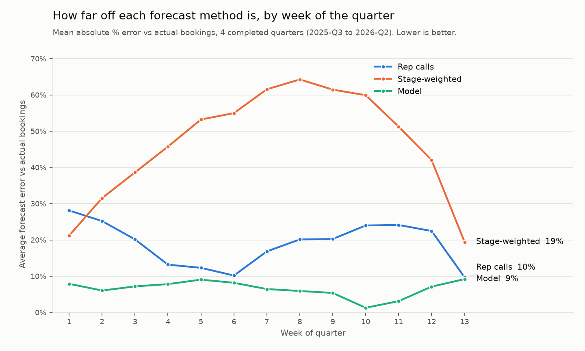

# Pipeline Health and Forecast Accuracy

Sales analytics for a SaaS company that sells two ways: a self-serve product that users adopt on their own, and an enterprise sales team that closes the larger accounts growing out of it.

The question a sales leader asks every week: **are we going to hit the number this quarter, and can we trust what the reps are telling us?**



## Key findings

- **Pipeline coverage has fallen from 5.4x to 2.3x at quarter start** as quota more than doubled (EUR 3.3M to 8.2M) while pipeline stayed flat. Only the quarter that started above 5x hit target; every quarter since finished between 79% and 97%.
- **Won deals move fast, lost deals stall.** Won deals spend about a week in each stage. Lost deals spend two to nine times longer, up to 75 days in Negotiation.
- **Close-date pushes are an early warning.** Deals pushed once win 44% of the time; pushed twice, 25%; three or more times, 7%.
- **Forecasts are off in predictable ways.** Rep calls run 20 to 24% high in the last month of the quarter. The default stage-probability method overstates bookings by up to 64%. A simple model trained on the company's own history stays within 10% in every week.
- **This quarter:** EUR 7.1M closed against EUR 8.2M quota in week 12. The model expects about EUR 8.1M; the reps call EUR 8.5M.

The full write-up is in [docs/memo.md](docs/memo.md) and the Metabase dashboard is in [docs/dashboard.pdf](docs/dashboard.pdf).

## Data

Synthetic data modelled on a product-led plus enterprise SaaS business, Jan 2024 to Sep 2026: 4,200 opportunities with full Salesforce-style field history, 36 sales reps with quarterly quotas, weekly rep forecast submissions, 9,140 accounts, 26,000 leads and monthly product usage for 24,000 workspaces.

It deliberately includes common CRM problems: a Salesforce migration that cut off older history, duplicate account records, mixed currencies, missing deal amounts, deals past their close date and deals owned by reps who have left. Table and column details are in [docs/data_dictionary.md](docs/data_dictionary.md).

## Approach

| Step | What | File |
|---|---|---|
| 1 | Load 12 raw tables into PostgreSQL | `sql/00_load_raw.sql` |
| 2 | Staging layer: merge duplicate accounts, standardise labels, convert to EUR. Rebuild the pipeline as it looked every Monday from field history (weekly snapshot, 197,628 rows) | `sql/10_pipeline_snapshot.sql` |
| 3 | Pipeline health: coverage vs quota, stage conversion, time in stage, slippage, win rate by pushes | `sql/20_pipeline_health.sql` |
| 4 | Forecast backtest: rep calls vs stage-weighted pipeline vs a logistic regression, trained walk-forward so each quarter is predicted only from earlier quarters | `python/30_forecast_backtest.py` |
| 5 | Dashboard in Metabase, one-page memo | `docs/` |

The SQL is organised in layers (`raw`, `staging`, `marts`), the same structure as dbt models.

## Run it yourself

Needs Docker and Python 3.

```bash
# 1. PostgreSQL in Docker
docker run -d --name pg -e POSTGRES_PASSWORD=postgres -p 5432:5432 postgres:16

# 2. Load the data and build the models
docker exec pg mkdir -p /tmp/sale_analytics
docker cp data/. pg:/tmp/sale_analytics/
docker exec pg chmod -R a+rX /tmp/sale_analytics
docker cp sql/. pg:/tmp/sql/
docker exec pg psql -U postgres -d postgres       -f /tmp/sql/00_load_raw.sql
docker exec pg psql -U postgres -d sale_analytics -f /tmp/sql/10_pipeline_snapshot.sql
docker exec pg psql -U postgres -d sale_analytics -f /tmp/sql/20_pipeline_health.sql

# 3. Forecast backtest (writes results back to the database and to python/output/)
pip install -r python/requirements.txt
python python/30_forecast_backtest.py
```

Steps 2 and 3 take under a minute in total.

## Limitations

The data is synthetic, so the patterns are cleaner than in a real CRM, and the forecast was tested on four quarters. On real data I would expect the model's advantage over rep calls to be smaller, and I would validate it over at least two more quarters before relying on it.

## Tools

PostgreSQL, SQL, Python (pandas, scikit-learn, matplotlib), Metabase, Docker.
